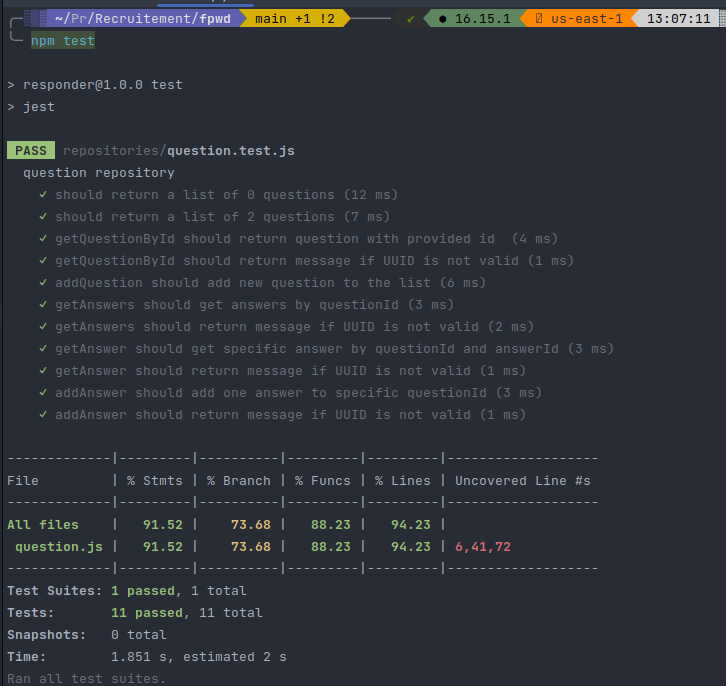

# Welcome to the responder

## Overview and the goal

This is a REST API that uses `express.js` for simple questions and answers submissions. The data is stored in the file `questions.json`. Initially, just a first few API endpoints are implemented. The goal of this exercise is to create and test the rest of the endpoints.

## Structure

The solution is a basic skeleton of `express.js` app:

1. The starting point is `index.js` - it contains the routes definitions. Most of them are empty and should be implemented as part of solving this exercise. Use the `GET /questions` route as a reference.
2. The `repositories/question.js` holds the data store (which is a simple file, stored on disk) for questions and answers. It also has functions that require implementation.
3. Ther is also a test file for `question repository`. Put your repository tests there.
4. The `middleware/repositories.js` hooks a repository into the `req` object of `express.js`. No need to extend anything here.

## Some assumptions

1. The structure of questions and answers objects can be deducted from `questions.json`.
2. The `id` are GUID's (there is already `uuid` package added to `package.json` to facilitate their creation - use `v4`).
3. For endpoints that have `id` parameter it will look something like this:

```
GET /questions/50f9e662-fa0e-4ec7-b53b-7845e8f821c3/answers/d498c0a3-5be2-4354-a3bc-78673aca0f31
```

## Final words

Please make sure you write unit tests - part of the exercise is to explore your ability to write them. Also, try to cover all endpoints, however, this is not crucial.

## How to send the solution back

Upload your soultion to either Github or Gitlab and send us the link.


## Final Tests coverage for repositories/question


